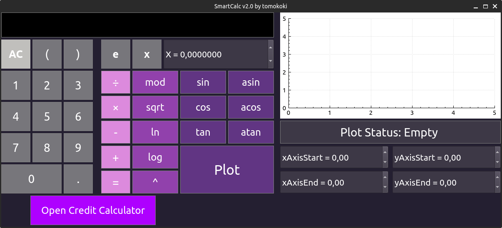
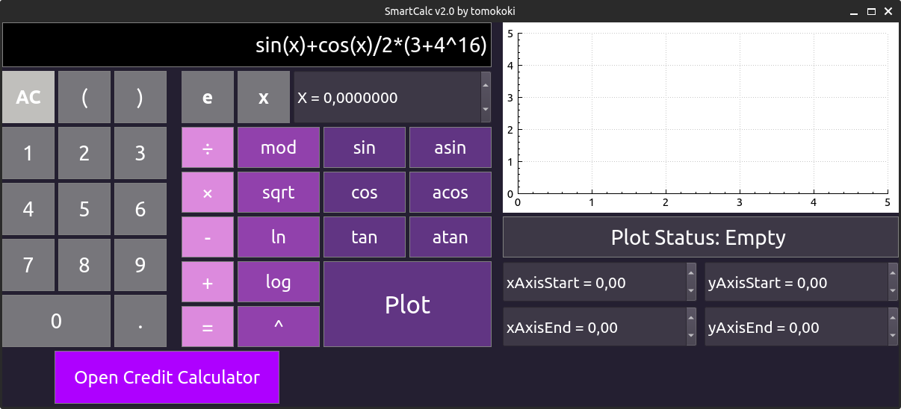
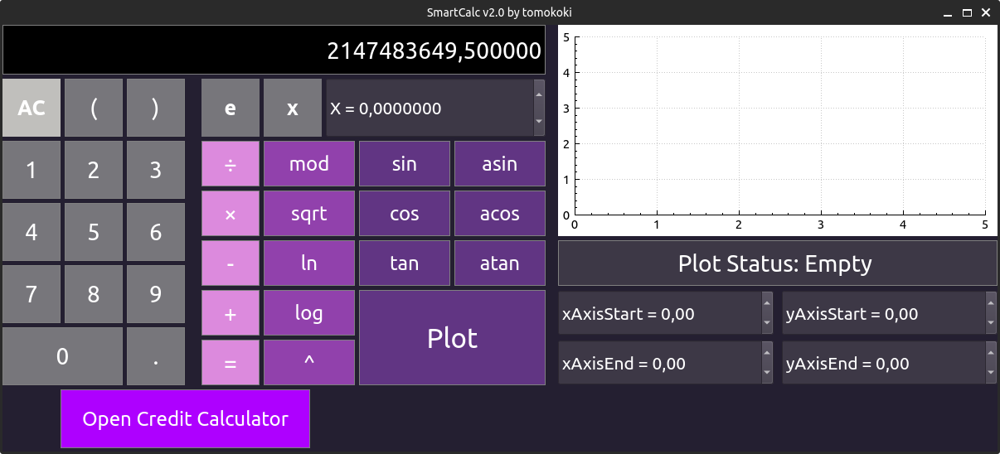
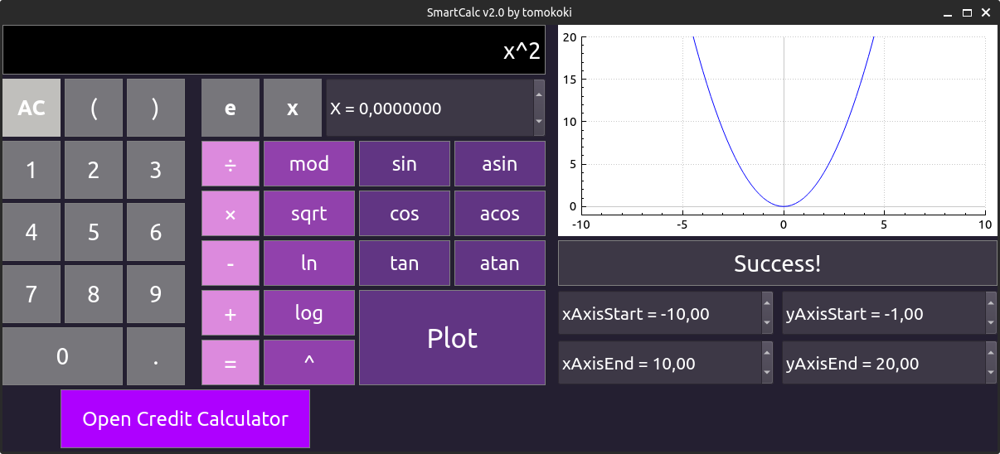
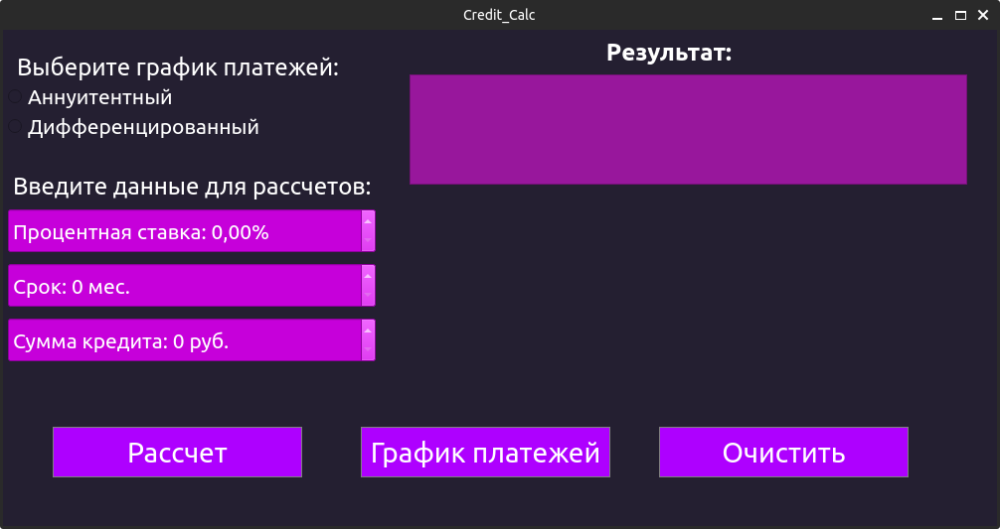
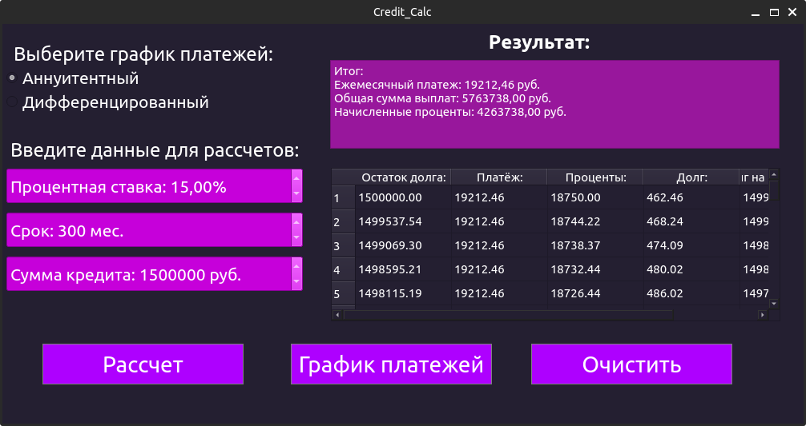

# SmartCalc v2.0

В данном проекте реализован **каклькулятор** на языке C++ в парадигме объектно-ориентированного программирования, который позволяет вычислять выражения в инфиксной записи, с помощью их перевода в польскую нотацию. На вход программы могут подаваться как целые числа, так и вещественные числа, записанные через точку. Также обрабатывается ввод чисел в экспоненциальной записи. Также был применен __паттерн MVC__.

**Поддерживаемые операторы:**

| Название оператора   | Инфиксная нотация   (Классическая) | Префиксная нотация   (Польская нотация) | Постфиксная нотация   (Обратная польская нотация) |
| -------------------- | --------------------------------------- | -------------------------------------------- | ------------------------------------------------------ |
| Скобки               | (a + b)                                 | (+ a b)                                      | a b +                                                  |
| Сложение             | a + b                                   | + a b                                        | a b +                                                  |
| Вычитание            | a - b                                   | - a b                                        | a b -                                                  |
| Умножение            | a * b                                   | * a b                                        | a b *                                                  |
| Деление              | a / b                                   | / a b                                        | a b \                                                  |
| Возведение в степень | a ^ b                                   | ^ a b                                        | a b ^                                                  |
| Остаток от деления   | a mod b                                 | mod a b                                      | a b mod                                                |
| Унарный плюс         | +a                                      | +a                                           | a+                                                     |
| Унарный минус        | -a                                      | -a                                           | a-                                                     |

**Функции:**  

| Описание функции               | Функция |
| ------------------------------ | ------- |
| Вычисляет косинус              | cos(x)  |
| Вычисляет синус                | sin(x)  |
| Вычисляет тангенс              | tan(x)  |
| Вычисляет арккосинус           | acos(x) |
| Вычисляет арксинус             | asin(x) |
| Вычисляет арктангенс           | atan(x) |
| Вычисляет квадратный корень    | sqrt(x) |
| Вычисляет натуральный логарифм | ln(x)   |
| Вычисляет десятичный логарифм  | log(x)  |

Возможно __построение графика функции__, заданной с помощью выражения в инфиксной нотации с переменной x.
Также предусмотрен специальный режим __"кредитный калькулятор"__. Он позволяет составить график платежей на определенный срок.

## Требования к проекту

- Программа должна быть разработана на языке C++ стандарта C++17;
- При написании кода необходимо придерживаться Google Style;
- Подготовить полное покрытие unit-тестами модулей, связанных с вычислением выражений, c помощью библиотеки GTest;
- Сборка программы должна быть настроена с помощью Makefile со стандартным набором целей для GNU-программ;
- Реализация с графическим пользовательским интерфейсом, на базе Qt;

## Запуск проекта 

- Для установки вам необходимо перейти в дирректорию __src__ и в терминале выполнить команду `make install`. Приложение будет установленно в паку __build__;
- Чтобы выполнить деинтсаляцию - выполните команду `make uninstall`;
- Для формирования __tgz архива__ -  выполните команду `make dist`. Сформированный файл будет находиться в папке __dist__;
- Для запуска тестов необходимо в терминале выполнить команду `make test`;
- Чтобы посмотреть покрытие кода - выполните команду `make gcov_report`;

## Руководство

Основы работы с приложением:
- Чтобы ввести выражение для рассчета, выможете использовать два возможных варианта ввода:
  - Ввод посредством нажатия соответсвующих кнопок;
  - Ввод напрямую с клавиатуры;
- Чтобы задать значение для переменной __x__, используйте соотвествующий SpinBox (он находится справа от кнопки), введите в нем нужное вам значение;
- Далее для выполнения рассчетов нажмите на кнопку __=__. Результат вычислений отобразится на поле, куда вводились данные.
  - Если произошла __ошибка__ (деление на ноль, некорректный ввод) - её название и пояснение будет выведенно на поле ввода;
  - Если все прошло успешно, будет выведен числовой результат с точностью 7 знаков после запятой;
- Для построения графика необходимо:
  - Выбрать диапазон для осей __x__ и __y__;
  - Ввести функцию как обычное выражение для расчета;
  - Нажать на кнопку __"Plot"__;
  - Под графиком выводится информация о статусе отрисовки графика - __Ошибка__ или __Успех__;
- Чтобы открыть кредитный калькулятор, нажмите кнопку __"Open Credit Calc"__
  - Для расчетов нужно заполнить следующую инфоормацию:
    - Тип платежа - аннуитентный/диффернцированный;
    - Процентная ставка _(предел 365%)_; 
    - Срок в месяцах;
    - Сумма;
  - Далее нажмите на кнопку __"Расчет"__;

## Примеры

Калькулятор:

Ввод значения:

Результат рассчета:

Построение графика:

Кредитный калькулятор:

Результат рассчета кредитного калькултора:
